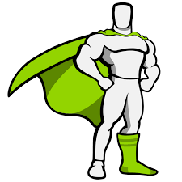

<h1 align="center">
<a href="https://git.io/typing-svg"></a>
</h1>

<h5 align="center">
  <code><a href="https://www.linkedin.com/in/oktayrasimov/" title="LinkedIn Profile"> LinkedIn</a></code>
  <code><a href="https://stackoverflow.com/users/22113933/okitoo" title="Stack Overflow Profile"> Stack Overflow</a></code>
  <code><a href="https://www.instagram.com/okito__/" title="Instagram Profile"> Instagram</a></code>
</h5>
<br>

- 🛠  &nbsp;𝘔𝘢𝘬𝘪𝘯𝘨 𝘮𝘺 𝘱𝘳𝘰𝘫𝘦𝘤𝘵𝘴 𝘣𝘦𝘵𝘵𝘦𝘳 𝘣𝘺 𝘵𝘩𝘦 𝘥𝘢𝘺
- 💬 &nbsp;Feel free to a𝘴𝘬 𝘮𝘦 𝘢𝘯𝘺𝘵𝘩𝘪𝘯𝘨 𝘳𝘦𝘭𝘢𝘵𝘦𝘥 𝘵𝘰 𝘑𝘢𝘷𝘢𝘴𝘤𝘳𝘪𝘱𝘵/𝘙𝘦𝘢𝘤𝘵
- 🎮 &nbsp;𝘋𝘪𝘴𝘤𝘰𝘳𝘥 𝘵𝘢𝘨&nbsp;:&nbsp;𝘧𝘢𝘤𝘦𝘪𝘵100
<hr>


- 🔨 𝙸'𝚖 𝚌𝚞𝚛𝚛𝚎𝚗𝚝𝚕𝚢...
```yaml
-Building projects with Next.js
```

<hr>
<h3 align="center">🔥 Languages, Frameworks & Tools 🔥</h3>
<br/>

<table><tr>
<td valign="top" width="33%">
</td>
<td valign="top" width="33%">
<h3 align='center'>𝗠𝗮𝗶𝗻 𝗟𝗮𝗻𝗴𝘂𝗮𝗴𝗲𝘀</h3>
<div align="center">
<code></code>
<code></code>
<code></code>
</div>
</td>
<td valign="top" width="33%">
</td>
</tr>
<tr>
<td valign="top" width="33%">
<h3 align='center'>𝗙𝗿𝗼𝗻𝘁 𝗘𝗻𝗱</h3>
<div align="center">
<code></code>
<code></code>
<code></code>
<code></code>
<code></code>
<code></code>
<code></code>
<code></code>
<code></code>
</div>
</td>
<td valign="top" width="33%">
<h3 align='center'>𝗕𝗮𝗰𝗸 𝗘𝗻𝗱</h3>
<div align="center">
<code></code>
<code></code>
<code></code>
<code></code>
<code></code>
</div>
</td>
<td valign="top" width="33%">
<h3 align='center'>𝗢𝘁𝗵𝗲𝗿 𝗧𝗼𝗼𝗹𝘀</h3>
<div align="center">
<code></code>
<code></code>
<code></code>
<code></code>
<code></code>
<code></code>
<code></code>
<code></code>
<code></code>
<code></code>
<code></code>
<code></code>
</div>
</td>
</tr></table>
<hr>

<h2 align="center">⚡ 𝗦𝘁𝗮𝘁𝘀 ⚡</h2>
<br>
<p align=center>
  <div align=center>
      
      
  </div>
  <br><br><br><br><br><br><br><br><br>
  <div align=center>
      
  </div>
  <br>

  
</p>

<hr>

<h2 align="center">👨‍💻 𝗥𝗲𝗽𝗼𝘀𝗶𝘁𝗼𝗿𝗶𝗲𝘀 👨‍💻</h2>
<br/>
<div width="100%" align="center">
  <a align="left" href="https://github.com/OktayRasimov/pin-point" title="PinPoint"></a>
  <a align="right" href="https://github.com/OktayRasimov/watch-track" title="WatchTrack"></a>
</div>
<br/><br/><br/><br/><br/><br/>
<div width="100%" align="center">
  <a align="left" href="https://github.com/OktayRasimov/booky" title="Booky"></a>
  <a align="right" href="https://github.com/OktayRasimov/i-message" title="iMessage"></a>
</div>
<br/><br/><br/><br/><br/><br/>
<div width="100%" align="center">
  <a align="left" href="https://github.com/OktayRasimov/weather-app-node" title="WeatherApp-Node"></a>
  <a align="right" href="https://github.com/OktayRasimov/personal-project" title="Personal Project Base"></a>
</div>
<br/><br/><br/><br/><br/><br/>
<div width="100%" align="center">
  <a align="left" href="https://github.com/OktayRasimov/car-project" title="Car Rental Project"></a>
</div>
<br/><br/><br/><br/><br/><br/>
<h4 align="center">
  <a href="https://github.com/OktayRasimov?tab=repositories" title="Show Repositories">🔎 Show More 🔍</a>
</h4>
